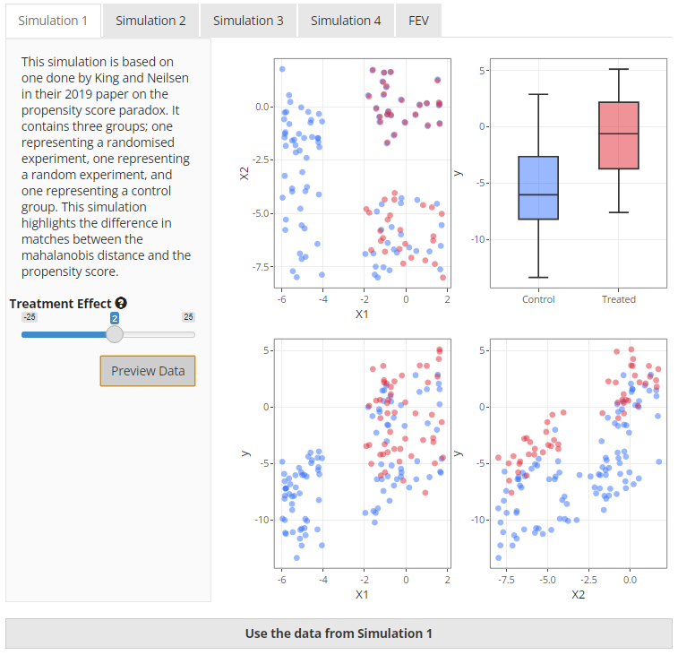
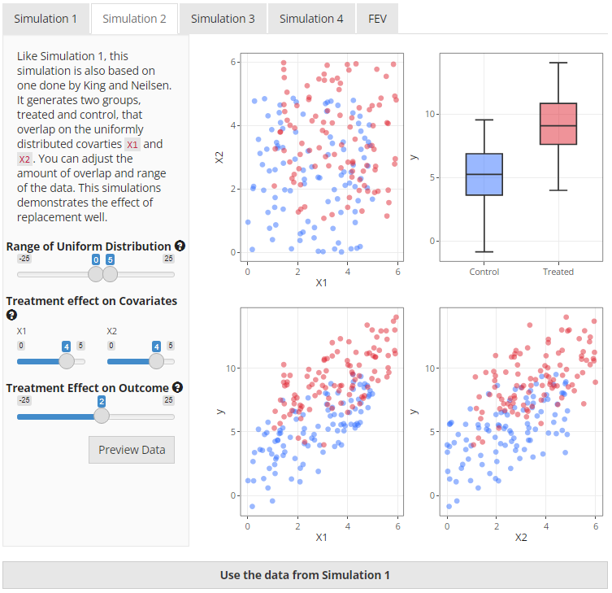

```{r, include = FALSE}
knitr::opts_chunk$set(
  collapse = TRUE,
  comment = "#>",
  echo = FALSE
)
```

```{=html}
<script src="https://kit.fontawesome.com/e10eea7053.js" crossorigin="anonymous"></script>
```


From the main page, clicking on the <i class="fas fa-cog"></i> icon under the title opens up a modal dialogue box that is displayed in the following figures. This modal gives the user access to data from four different simulations and a real dataset. I will briefly outline each of the simulations below.

### Simulation 1

This simulation is based on the data generation process described by King and Neilsen[@King2019]. Essentially, it contains two experiments---a fully blocked randomised experiment and a completely randomised experiment---hidden within an imbalanced "observational" dataset. If you look at Figure 3, the first plot (top left) makes this clearer. The fully blocked randomised experiment is in the top right corner of the plot which is demonstrated by the treated (red) and untreated (blue) units being virtually right on top of one another. The completely randomised experiment is just below it in the bottom right corner of the plot and you can clearly see that there are similar numbers of treated and control units which are balanced on average but not exactly matched. The imbalanced observational data is represented by the placement of additional untreated units on the left of the plot.

```{=html}
<table style="border: none;">
  <caption style="text-align:left; caption-side:top;"> Figure 1. Simulation 1 Preview</caption>
  <tr>
  	  <td style="text-align:center"> </img></td>
  </tr>
</table>
```
King and Neilsen[@King2019] use this simulation to demonstrate the ability of different matching methods to select the units in a logical order. Ideally, the data from the fully blocked randomised experiment should be matched first, then the data from the completely randomised experiment. It has been included in the app as it provides a clear demonstration of the performance of Mahalanobis-based distance matching versus propensity score-based distance matching.

In the app, you are able to change the treatment effect but that should not change the outcome of the matching process in any way, only the calculation of the treatment estimate.

### Simulation 2

Simulation 2 is also taken from King and Neilsen[@King2019] however the data are very different. This simulation uses two overlapping uniform distributions defined by two continuous covariates, `X1` and `X2`, that both affect the treatment received and the outcome. When visualising the two covariates, `X1` and `X2`, on a two dimensional field, the data has the appearance of a square of treated units overlapped by a square of untreated units. This can be clearly seen in the top left plot in Figure 4 below.

```{=html}
<table style="border: none;">
  <caption style="text-align:left; caption-side:top;"> Figure 2. Simulation 2 Preview</caption>
  <tr>
  	  <td style="text-align:center"> </img></td>
  </tr>
</table>
```
Users have the ability to change the range of the uniform distribution, the strength of association between the covariates (`X1` and `X2`) and the treatment variable (`t`), and the treatment effect on the outcome (`y`). A useful application of this simulation is to compare what happens when the matching algorithm is with or without replacement, particularly if there is a strong association between the covariates and treatment (see the example [*To Replace or Not to Replace*](Examples.html#example2) in the Examples vignette.

### Simulation 3

This simulation uses causal relationships to define the effects between the treatment, covariates, and outcome. There are five options available to the user that can change the relationships between the treatment indicator `t`, the outcome `y` and two covariates `X1` and `X2`. Figure 5 represents these possible relationships using a causal diagram with an arrow pointing in the direction of the assumed effect in the data generation process.  

```{=html}
<table style="border: none;">
  <caption style="text-align:left; caption-side:top;">Figure 3. Simulation 3 Casual Relationships</caption>
  <tr>
  	  <td style="text-align:center"> </img></td>
  </tr>
</table>
```
To generate the data, first we create the covariates, `X1` and `X2`, as a bivariate normal distribution with a correlation of 0.2. The treatment variable is then generated based on the selection after which the function then iteratively works through the selected options and applies changes to the data as appropriate. It should be noted that the user can not change the strength of the effects in this simulation. Nor can the relationship between `t` and `y` be changed, although they can both be altered via `X1` and `X2`. Other than the causal relationships, only the treatment effect can be modified. This has been done to allow for simple data generation. Figure 6 below provides an example of data generated using this simulation, with `X1` and `X2` both defined as mediators between treatment `t` and outcome `y`. 

```{=html}
<table style="border: none;">
  <caption style="text-align:left; caption-side:top;">Figure 4. Simulation 3 Preview</caption>
  <tr>
  	  <td style="text-align:center"> </img></td>
  </tr>
</table>
```
### Simulation 4

This is the last simulation. Like simulation 3, `X1` and `X2` are taken from a bivariate normal distribution. However, in this simulation, `X1` and `X2` act as a confounder, an ancestor of `t`, or an ancestor of `y`. This is achieved by altering the weights of the effect on the treatment `t` and the outcome `y`. In this simulation it is also possible to change the covariance between `X1` and `X2`. See Figure 7 below for an example of data generated using simulation 4.

```{=html}
<table style="border: none;">
  <caption style="text-align:left; caption-side:top;">Figure 5. Simulation 4 Preview</caption>
  <tr>
  	  <td style="text-align:center"> </img></td>
  </tr>
</table>
```
### Real Data - FEV

The *Forced Expiratory Volume* dataset is available from the `mplot`[@mplot] package. For the purposes of the app, it has been utilised to demonstrate how matching works on real data using `smoke` as the treatment variable and `fev` as the outcome. This dataset was ideal for this project because it was relatively small, contains only a few variables, and contains a treatment and outcome variable. A preview of the dataset is presented in Figure 8.

```{=html}
<table style="border: none;">
  <caption style="text-align:left; caption-side:top;">Figure 6. Forced Expiratory Volume Preview</caption>
  <tr>
  	  <td style="text-align:center"> </img></td>
  </tr>
</table>
```

This is a useful teaching dataset[@kahn2005exhalent] because the "treatment" of smoking and the outcome of forced expiratory volume are highly confounded by age. Younger children are less likely to smoke but also have lower respiratory volume by dent of being physically smaller. Thus a naive analysis of the associations in the data would suggest that non-smokers have _reduced_ lung capacity. 

## References
