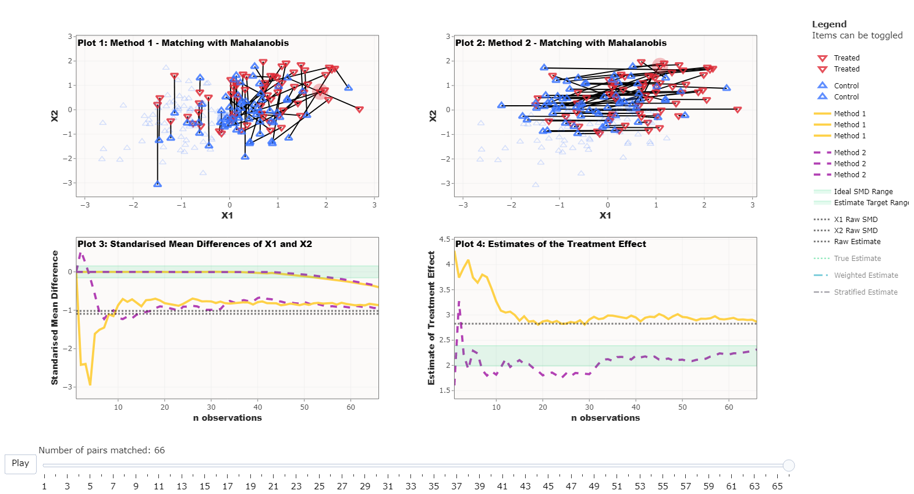

```{r, include = FALSE}
knitr::opts_chunk$set(
  collapse = TRUE,
  comment = "#>"
)
```

```{=html}
<script src="https://kit.fontawesome.com/e10eea7053.js" crossorigin="anonymous"></script>
```
## Overview

In this vignette I present four examples of important lessons that can be interactively explored using the WhatsMatching app. These examples have been selected to highlight just a few of the ways the app can lift the lid on the black box of matching. The four examples are:

-   [Matching finds the experiment hidden in observational data](#example1)

-   [To Replace or Not to Replace](#example2)

-   [Ordering changes unit selection](#example3)

-   [Covariate and Model Selection Matter](#example4)

This section concludes with some suggested future extensions of the WhatsMatching app.

## Matching finds the experiment hidden in observational data {#example1}

This example uses simulation 1, which generates two experiments "hidden" within an unbalanced dataset---a fully blocked randomised experiment and a fully randomised experiment. Covariates `X1` and `X2` are generated with the fully blocked experiment being almost identically paired between treated and control units; the random experiment group has randomly placed treated and control units; and imbalanced control group consists of only control units and no treated units.

The methods being compared in this example are the use of the Mahalanobis Distance Matching (MDM) and Propensity Score Matching (PSM). The outcome demonstrated is that, under these conditions, MDM is superior to PSM in selecting the fully blocked experiment first. This occurs because the Propensity score, once calculated, is blind to the real data that informs the probability of treatment whereas the Mahalanobis Distance is the actual distance *between* units based on their observed covariates.

```{=html}
<table style="border: none; text-align: center;">
  <caption style="text-align:left; caption-side:top;"> Figure 1. Fully Blocked Experiment</caption>
  <tr>
  	  <td colspan="3"> </img></td>
  </tr> 
  <tr>
    <th style="text-align: left;">Setting</th>
    <th>Method 1</th>
    <th>Method 2</th>
  </tr>
  <tr>
    <td style="text-align: left;">Matching Distance</td>
    <td>Mahalanobis Distance</td>
    <td>Propensity Score</td>
  </tr>
  <tr>
    <td style="text-align: left;">Matching Covariates</td>
    <td><code>X1</code>, <code>X2</code></td>
    <td><code>X1</code>, <code>X2</code></td>
  </tr>
  <tr>
    <td style="text-align: left;">Matching Order</td>
    <td>data</td>
    <td>data</td>
  </tr>
  <tr>
    <td style="text-align: left;">Matching Replacement</td>
    <td>No</td>
    <td>No</td>
  </tr>
  <tr>
    <td style="text-align: left;">Treatment Effect on the Outcome</td>
    <td colspan="2"><code>y ~ t</code></td>
  </tr>

</table>
```
**Take home message:** The propensity score is blind to the underlying values of the matching covariates and therefore may not be the best choice for achieving covariate balance, which is a primary aim of matching.

::: {style="display: block; border: 1px solid #3a3b3c; background-color:#f7f7f7; color:#3a3b3c; margin:20pt; padding:10pt"}
::: {style="font-size:2em; float: left; margin-right: 1em;"}
<a href='https://jmeyer2482.shinyapps.io/WhatsMatching/' target="_blank">  </a>
:::

::: {style="display:block; margin-left: 3em;"}
**Run this example in the app:** [https://jmeyer2482.shinyapps.io/WhatsMatching/](https://jmeyer2482.shinyapps.io/WhatsMatching/){target="_blank"} <i class="fas fa-up-right-from-square"></i>

-   Click Settings <i class="fas fa-cog"></i> and choose *Simulation 1*
-   Optionally change the treatment effect and click Preview data
-   Click *Use the data from Simulation 1* below
-   Update the matching settings as laid out above (Fig. 1)
-   Click *Use these matching settings*\
-   Press play
:::
:::

## To Replace or Not to Replace {#example2}

We demonstrate in Figure 2 that the intuitiveness behind using replacement may not be clear. This simulation is also from the King and Neilsen paper. The covariates `X1` and `X2` constitute two overlapping uniform distributions for the treated and control groups. There are 200 units in the dataset with 100 units in each group. In this example, the matching approach is always propensity score matching, we have only changed whether the matches are conducted with replacement (Method 1) or without replacement (Method 2).

In Figure 2, you can clearly see that when the matching algorithm permits replacement there are several treated units matched to a single control unit. Comparing the balance in the matched dataset under the two approaches (Plot 3), you can see that as the matching proceeds the standardised mean distance between the treated and control units is stable when replacement is allowed but starts to deteriorate after about the 60th match when replacement is not allowed. Similarly, the estimated treatment effect (Plot 4) shows that propensity score with replacement results in an unbiased estimate of the known treatment effect, whereas the propensity score without replacement results in a highly biased estimate. These results reflect that, in the absence of replacement, the quality of matches deteriorates as the matching algorithm proceeds. In real life applications, a callipers to impose a minimum threshold in distance when making matches.

```{=html}
<table style="border: none; text-align: center;">
  <caption style="text-align:left; caption-side:top;"> Figure 2. Replacement</caption>
  <tr>
  	  <td colspan="3"> </img></td>
  </tr> 
  <tr>
    <th style="text-align: left;">Setting</th>
    <th>Method 1</th>
    <th>Method 2</th>
  </tr>
  <tr>
    <td style="text-align: left;">Matching Distance</td>
    <td>Propensity Score</td>
    <td>Propensity Score</td>
  </tr>
  <tr>
    <td style="text-align: left;">Matching Covariates</td>
    <td><code>X1</code>, <code>X2</code></td>
    <td><code>X1</code>, <code>X2</code></td>
  </tr>
  <tr>
    <td style="text-align: left;">Matching Order</td>
    <td>data</td>
    <td>data</td>
  </tr>
  <tr>
    <td style="text-align: left;">Matching Replacement</td>
    <td>Yes</td>
    <td>No</td>
  </tr>
  <tr>
    <td style="text-align: left;">Treatment Effect on the Outcome</td>
    <td colspan="2"><code>y ~ t</code></td>
  </tr>
  
</table>
```
**Take home message:** Datasets where the treated and control groups are approximately equal may require the consideration of different settings to achieve covariate balance and thus a more accurate estimate of the treatment effect.

::: {style="display: block; border: 1px solid #3a3b3c; background-color:#f7f7f7; color:#3a3b3c; margin:20pt; padding:10pt"}
::: {style="font-size:2em; float: left; margin-right: 1em;"}
<a href='https://jmeyer2482.shinyapps.io/WhatsMatching/' target="_blank">  </a>
:::

::: {style="display:block; margin-left: 3em;"}
**Run this example in the app:** [https://jmeyer2482.shinyapps.io/WhatsMatching/](https://jmeyer2482.shinyapps.io/WhatsMatching/){target="_blank"} <i class="fas fa-up-right-from-square"></i>

-   Click Settings <i class="fas fa-cog"></i> and choose Simulation 2
-   Optionally change any of the settings and click *Preview Data* (leaving the settings unchanged will replicate above)\
-   Click *Use the data from Simulation 2* below
-   Update the matching settings as laid out above (Fig. 2)
-   Click *Use these matching settings*\
-   Press play
:::
:::

## Ordering changes unit selection {#example3}

For this example we are using the same simulation as in Figure 2 above. This time we are comparing the ordering of the matches: Method 1 starts matching from the largest propensity score and Method 2 starts matching from the smallest propensity score. This essentially boils down to matching the treated units with the highest probability of being treated first or starting with those with the lowest probability of being treated.

We can see below in Figure 3 that *Plot 1* has made some unusual pairings. This makes some sense as when you pair units that have the highest probability of being treated first then you quickly increase the distances between the remaining units that need to be paired. This means that the "good matches" are getting further and further away.

This is a problem that can occur for any matching method as most matching methods use nearest neighbour methodology. If the best nearest neighbour is already paired then the process just moves to the next available one no matter the distance. This further highlights the advantage of using replacement which conveniently ignores ordering and selects the nearest partner irrespective of if it is matched.

```{=html}
<table style="border: none; text-align: center;">
  <caption style="text-align:left; caption-side:top;"> Figure 3. Ordering</caption>
   <tr>
  	  <td colspan="3"> </img></td>
  </tr> 
  <tr>
    <th style="text-align: left;">Setting</th>
    <th>Method 1</th>
    <th>Method 2</th>
  </tr>
  <tr>
    <td style="text-align: left;">Matching Distance</td>
    <td>Propensity Score</td>
    <td>Propensity Score</td>
  </tr>
  <tr>
    <td style="text-align: left;">Matching Covariates</td>
    <td><code>X1</code>, <code>X2</code></td>
    <td><code>X1</code>, <code>X2</code></td>
  </tr>
  <tr>
    <td style="text-align: left;">Matching Order</td>
    <td>largest</td>
    <td>smallest</td>
  </tr>
  <tr>
    <td style="text-align: left;">Matching Replacement</td>
    <td>No</td>
    <td>No</td>
  </tr>
  <tr>
    <td style="text-align: left;">Treatment Effect on the Outcome</td>
    <td colspan="2"><code>y ~ t</code></td>
  </tr>

</table>
```
**Take home message:** The ordering or optimisation method of how the matches are selected can impact what data is selected for analysis.

::: {style="display: block; border: 1px solid #3a3b3c; background-color:#f7f7f7; color:#3a3b3c; margin:20pt; padding:10pt"}
::: {style="font-size:2em; float: left; margin-right: 1em;"}
<a href='https://jmeyer2482.shinyapps.io/WhatsMatching/' target="_blank">  </a>
:::

::: {style="display:block; margin-left: 3em;"}
**Run this example in the app:** [https://jmeyer2482.shinyapps.io/WhatsMatching/](https://jmeyer2482.shinyapps.io/WhatsMatching/){target="_blank"} <i class="fas fa-up-right-from-square"></i>

-   Click Settings <i class="fas fa-cog"></i> and choose Simulation 1
-   Optionally change any of the settings and click *Preview Data* (leaving the settings unchanged will replicate above)\
-   Click *Use the data from Simulation 2* below
-   Update the matching settings as laid out above (Fig. 2)
-   Click *Use these matching settings*\
-   Press play
:::
:::

## Covariate and Model Selection Matter {#example4}

Covariate specification and model selection are important when undertaking matching. Ideally, the matching occurs in such a way that the model specification is less important (another problem for causal inference in observational data!) which will remove some of the bias. Simulation 4 has been used for this example with both `X1` and `X2` set to be strong confounders.

Matching has been completed using either `X1` or `X2` as though we don't know which one is a confounder. `X1` has also been added to the formula to calculate the estimate. These setting have been selected to demonstrate the importance of model and covariate selection when performing matching. As we can see below, the matching that was done with `X1` only performed as well as the raw estimate. Whereas, the model with `X2` performed much better.

```{=html}
<table style="border: none; text-align: center;">
  <caption style="text-align:left; caption-side:top;"> Figure 4. Missed confounder</caption>
  <tr>
  	  <td colspan="3"> </img></td>
  </tr>  
  <tr>
    <th style="text-align: left;">Setting</th>
    <th>Method 1</th>
    <th>Method 2</th>
  </tr>
  <tr>
    <td style="text-align: left;">Matching Distance</td>
    <td>Mahalanobis Distance</td>
    <td>Mahalanobis Distance</td>
  </tr>
  <tr>
    <td style="text-align: left;">Matching Covariates</td>
    <td><code>X1</code></td>
    <td><code>X2</code></td>
  </tr>
  <tr>
    <td style="text-align: left;">Matching Order</td>
    <td>data</td>
    <td>data</td>
  </tr>
  <tr>
    <td style="text-align: left;">Matching Replacement</td>
    <td>No</td>
    <td>No</td>
  </tr>
  <tr>
    <td style="text-align: left;">Treatment Effect on the Outcome</td>
    <td colspan="2"><code>y ~ t + X1</code></td>
  </tr>

</table>
```

**Take home message:** The treatment effect will be improved as along as both variables are accounted for in either the matching or the regression model.

::: {style="display: block; border: 1px solid #3a3b3c; background-color:#f7f7f7; color:#3a3b3c; margin:20pt; padding:10pt"}
::: {style="font-size:2em; float: left; margin-right: 1em;"}
<a href='https://jmeyer2482.shinyapps.io/WhatsMatching/' target="_blank">  </a>
:::

::: {style="display:block; margin-left: 3em;"}
**Run this example in the app:** [https://jmeyer2482.shinyapps.io/WhatsMatching/](https://jmeyer2482.shinyapps.io/WhatsMatching/){target="_blank"} <i class="fas fa-up-right-from-square"></i>

-   Click Settings <i class="fas fa-cog"></i> and choose Simulation 4  
-   Set the effect on treatment to 1 for both `X1` and `X2`  
-   Set the effect on outcome to 1 for both `X1` and `X2`  
-   Other settings can be changed as desired  
-   Set matching settings as laid out above
-   Press play
:::
:::
