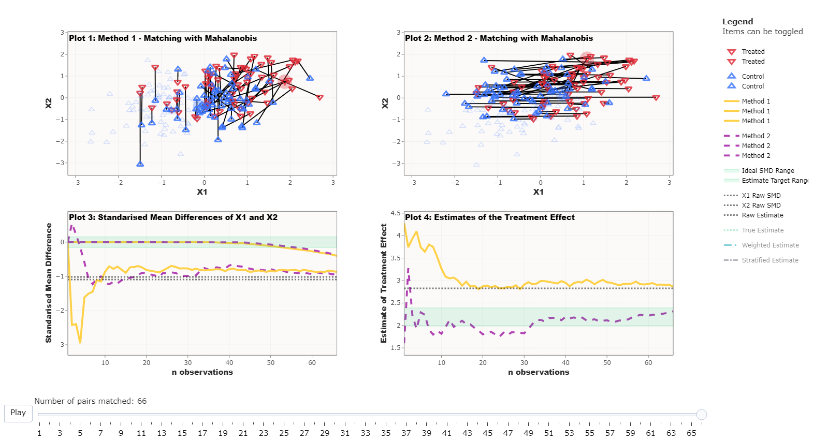

```{r, include = FALSE}
knitr::opts_chunk$set(
  collapse = TRUE,
  comment = "#>",
  echo = FALSE
)
```

```{r setup}
# library(WhatsMatching)
```


## The nuts and bolts (“the server side”)  

This project has been developed as a Shiny app using the Golem framework to support it's production. There are a number of key functions that have been implemented to generate the data and matching processes. Let's have a look in a bit more detail. 

### The golem framework  

The <a href="https://golemverse.org/" target="_blank">Golem framework</a> is the brain child of Colin Fay. In essence, Shiny apps are ideal for development as a R package. That is to say that, the package structure lends itself well to the development of production grade Shiny apps.  

The `golem` package itself provides functions and helpers to generate and create the framework that can be used for the development of the Shiny app and package. In addition, there are <a href="https://engineering-shiny.org/" target="_blank"> theoretical underpinnings and best practice advice</a> provided to give the best chance of developing a high quality application.

### Key functions and functionality  

There are <a href="https://jmeyer2482.github.io/WhatsMatching/reference/index.html" target="_blank">four key functions</a> that have been developed as part of the package in order to make data generation and analysis as straightforward as possible. They are `create.sim.data`, `matched.data`, `matching.plot`, and `combined.plot`. The functions have been designed to follow and iterative process.

#### `create.sim.data()`  

As the name suggests, this is the data simulation function. There are four simulations available for use within the app. Each one has a specific type of data generation to expore the matching process.  

*Simulation 1* is based on King and Neilsen's most simplistic illustration of finding the hidden experiment in the data.  

*Simulation 2* is based on King and Neilsen's illustration to show model dependence and bias.  

*Simulation 3* is generated based on using 2 covariates with a normal distribution. The user can change the causal relationships between the covariates and/or the treatment and outcome variables but cannot change the strength of the relationships.  

*Simulation 4* uses a bivariate normal distribution to generate data where the user can alter the level of confounding between the covariates and the treatment and outcome variables.  

#### `matched.data()`  

This is the function that conducts the matches. It primarily uses `match_on()` function in the `optmatch` package to generate a $n x p$ matrix of matches for the chosen method, where $n$ is the number of control units and $p$ is the number of treated units. The output is then used to generate the actual matches along with a number of other outputs that allow further exploration of the data outside of the app if desired. However, it should be noted that this function is not designed for complex matching and may not be suitable for use with categorical data, for example.  

#### `matching.plot()`  

This function takes the output from the `matched.data` function and turns it into a `plotly` plot which shows an accumulative matching of the treated and control units. Outside the app, this plot can be generated on its own.  

#### `combined.plot()`  

The `combined.plot` function takes 2 different matching methods generated by the `matched.data` function and returns 4 subplots that highlight the differences between the matching methods. Plots 1 and 2 contain visualisations of the way the data has been matched, Plot 3 shows the standardised mean differences between the specified covariates and methods (specified in the function, not the formula), and Plot 4 shows the differences in caclulated estimate of the treatment effect for both methods. Plots 3 and 4 show the results for each set of matched data as shown in Plots 1 and 2 as a progression through the matching process with fixed values of the unadjusted data. Plot 4 also includes stratified and weighted propensity score estimates for comparison.

### Deployment (The app is here, the code is here and the vignettes are here)  

The development process for this app has meant that it has been most practical to manage on GitHub. All the associated files and documentation are hosted on a public GitHub repository - <a href="https://github.com/jmeyer2482/WhatsMatching" target="_blank">https://github.com/jmeyer2482/WhatsMatching</a>. In terms of the process undertaken, the `WhatsMatching` package is the vehicle for the Shiny App as suggested in Golem framework. From there, the `pkgdown` package has been used to create a package based <a href="https://jmeyer2482.github.io/WhatsMatching/" target="_blank">website</a> which can also be deployed from GitHub.  

The end result result of this developmental process means that there is a Shiny App and Package Website that can be used in an educational format. The GitHub hosting means that the package can be installed by running `devtools::install_github("jmeyer2482/Whatsmatching")` in an `R` environment making the functions available to more advanced users.  


## Simulations (“the UI side”)  

Here, we provide some examples that highlight the difficulties in making decisions about how the matching process should occur.

### Example A (data | user options | screenshot)  

We demonstrate in Fig. 2. that the intuitiveness behind using replacement may not be clear.  


  

### Example B (data | user options | screenshot)  

   


### Example C (data | user options | screenshot)  

   

### Example D (data | user options | screenshot)  


  

### Example E (data | user options | screenshot)  


