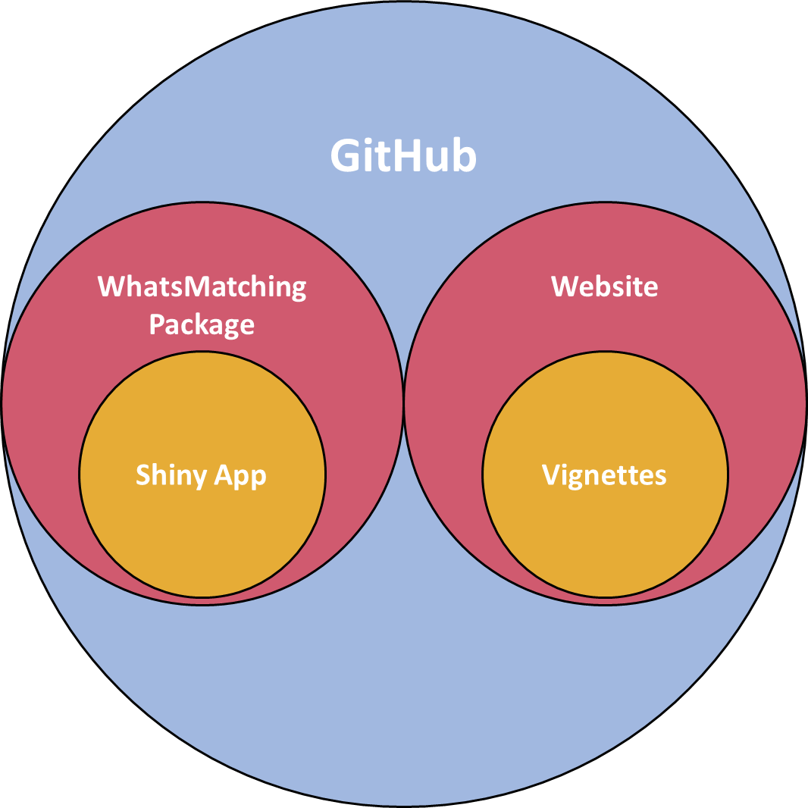
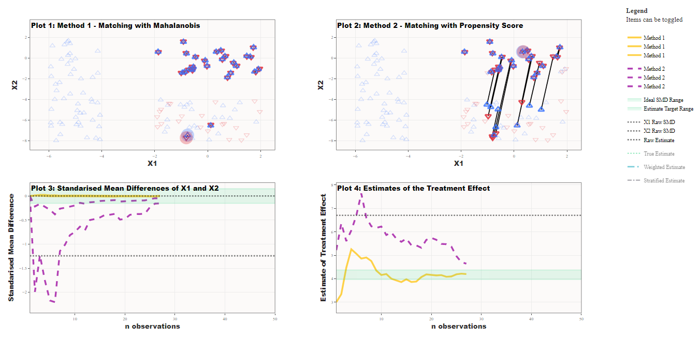
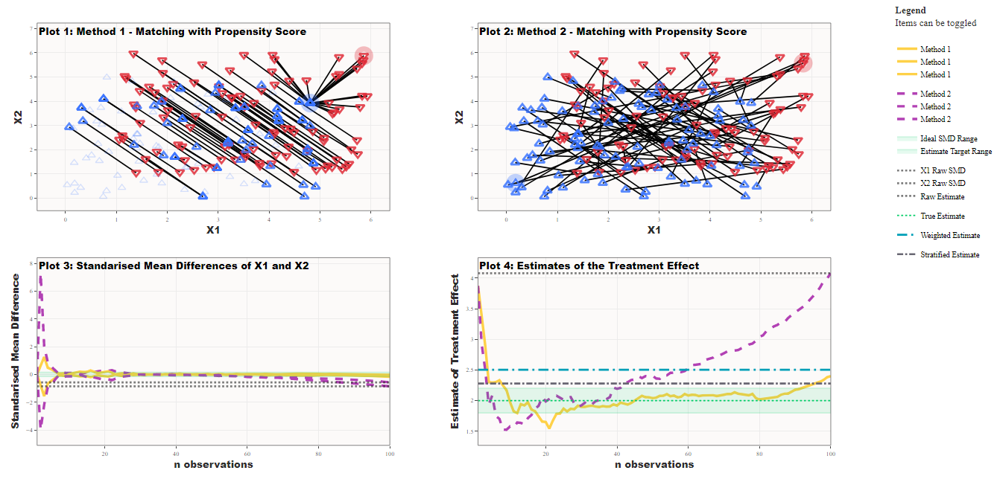
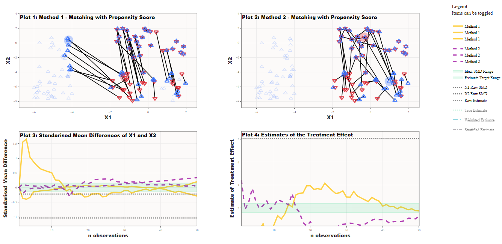

```{r, include = FALSE}
knitr::opts_chunk$set(
  collapse = TRUE,
  comment = "#>",
  echo = FALSE
)
```

```{r setup}
# library(WhatsMatching)
```


## The nuts and bolts (“the server side”)  

This project has been developed as a Shiny app using the Golem framework to support it's production. There are a number of key functions that have been implemented to generate the data and matching processes. Let's have a look in a bit more detail. 

### The golem framework  

The <a href="https://golemverse.org/" target="_blank">Golem framework</a> is the brain child of Colin Fay. In essence, Shiny apps are ideal for development as a R package. That is to say that, the package structure lends itself well to the development of production grade Shiny apps.  

The `golem` package itself provides functions and helpers to generate and create the framework that can be used for the development of the Shiny app and package. In addition, there are <a href="https://engineering-shiny.org/" target="_blank"> theoretical underpinnings and best practice advice</a> provided to give the best chance of developing a high quality application.

### Key functions and functionality  

There are <a href="https://jmeyer2482.github.io/WhatsMatching/reference/index.html" target="_blank">four key functions</a> that have been developed as part of the package in order to make data generation and analysis as straightforward as possible. They are `create.sim.data`, `matched.data`, `matching.plot`, and `combined.plot`. The functions have been designed to follow and iterative process.

#### `create.sim.data()`  

As the name suggests, this is the data simulation function. There are four simulations available for use within the app. Each one has a specific type of data generation to expore the matching process.  

*Simulation 1* is based on King and Neilsen's most simplistic illustration of finding the hidden experiment in the data.  

*Simulation 2* is based on King and Neilsen's illustration to show model dependence and bias.  

*Simulation 3* is generated based on using 2 covariates with a normal distribution. The user can change the causal relationships between the covariates and/or the treatment and outcome variables but cannot change the strength of the relationships.  

*Simulation 4* uses a bivariate normal distribution to generate data where the user can alter the level of confounding between the covariates and the treatment and outcome variables.  

#### `matched.data()`  

This is the function that conducts the matches. It primarily uses `match_on()` function in the `optmatch` package to generate a $n x p$ matrix of matches for the chosen method, where $n$ is the number of control units and $p$ is the number of treated units. The output is then used to generate the actual matches along with a number of other outputs that allow further exploration of the data outside of the app if desired. However, it should be noted that this function is not designed for complex matching and may not be suitable for use with categorical data, for example.  

#### `matching.plot()`  

This function takes the output from the `matched.data` function and turns it into a `plotly` plot which shows an accumulative matching of the treated and control units. Outside the app, this plot can be generated on its own.  

#### `combined.plot()`  

The `combined.plot` function takes 2 different matching methods generated by the `matched.data` function and returns 4 subplots that highlight the differences between the matching methods. Plots 1 and 2 contain visualisations of the way the data has been matched, Plot 3 shows the standardised mean differences between the specified covariates and methods (specified in the function, not the formula), and Plot 4 shows the differences in caclulated estimate of the treatment effect for both methods. Plots 3 and 4 show the results for each set of matched data as shown in Plots 1 and 2 as a progression through the matching process with fixed values of the unadjusted data. Plot 4 also includes stratified and weighted propensity score estimates for comparison.

### Deployment (The app is here, the code is here and the vignettes are here)  

The development process for this app has meant that it has been most practical to manage on GitHub. All the associated files and documentation are hosted on a public GitHub repository - <a href="https://github.com/jmeyer2482/WhatsMatching" target="_blank">https://github.com/jmeyer2482/WhatsMatching</a>. In terms of the process undertaken, the `WhatsMatching` package is the vehicle for the Shiny App as suggested in Golem framework. From there, the `pkgdown` package has been used to create a package based <a href="https://jmeyer2482.github.io/WhatsMatching/" target="_blank">website</a> which can also be deployed from GitHub.  

The end result result of this developmental process means that there is a Shiny App and Package Website that can be used in an educational format. The GitHub hosting means that the package can be installed by running `devtools::install_github("jmeyer2482/Whatsmatching")` in an `R` environment making the functions available to more advanced users.  

{width=50%}

## Simulations (“the UI side”)  

Here, we provide some examples that highlight the difficulties in making decisions about how the matching process should occur.

### Example A (data | user options | screenshot)  

This example uses one of the simulations from King and Neilsen's 2019 paper. It takes three groups representing a fully blocked experiment, a random experiment and a group of all controls. Covariates X1 and X2 are generated with the fully blocked experiment being almost identically paired between treated and control units and the random experiment group has, as you would guess, randomly placed  treated and control units. The control group consists of only control units and no treated units.  

The methods being compared in this example are the use of the Mahalanobis distance, which is calculated using the distance between a treated and control unit in the context of the covariance matrix, and the Propensity Score, which is essentially logistic regression on the treatment variable using selected covariates. The outcome demonstrated is that, under these conditions, the Mahalanobis distance is superior to the Propensity score in selecting the fully blocked experiment first. This occurs because the Propensity score, once calculated, is blind to the real data that informs the probability of treatment.  
Settings: Data from Simulation 1  
Method 1 - Mahalanobis ordered by data without replacement
Method 2 - Propensity score ordered by data without replacement
Matched on `X1` and `X2`
Treatment effect calculated using `y ~ t`

{width=100%}   

Take home message:  
The propensity score may not be the best choice for achieving covariate balance, which is a primary aim of matching.

### Example B (data | user options | screenshot)  

We demonstrate in Fig. 3. that the intuitiveness behind using replacement may not be clear. This simulation is also from the King ans Neilsen paper. `X1` and `X2` constitute 2 overlapping uniform distributions for the treated and control groups. There are 200 units in the dataset with 100 units in each group. For this simulation we have only changed whether the matches are conducted with replacement.  

You can clearly see that there are a number of the control units that are unmatched. This has occurred because there are other "closer" controls who can be matched to the treated units. If we look at *Plot 3* in the panel we can see that the covariate balance has been maintained and, as we expect, the estimate treatment effect approaches the true effect.      

Settings: Data from Simulation 2  
Method 1 - Propensity score ordered by data with replacement  
Method 2 - Propensity score ordered by data without replacement  
Matched on `X1` and `X2`  
Treatment effect calculated using `y ~ t`  

{width=100%}  

Take home message:  
Datasets where the treated and control groups are approximately equal may require the consideration of different settings to achieve covariate balance and thus a more accurate estimate of the treatment effect.  

### Example C (data | user options | screenshot)  

For this example we are using the same simulation as in Fig. 2. This time we are comparing the ordering of the matches. In this case comparison is starting with the smallest propensity score versus starting with the largest. This essentially boils down to matching the treated units with the lowest probability of being treated first or starting with those with the highest probability of being treated.  

We can see below in Fig. 4. that *Plot 1* has made some unusual pairings. This makes some sense as when you pair units that have the highest probability of being treated first then you quickly increase the distances between the remaining units that need to be paired. This means that the "good matches" are getting further and further away.  

This is a problem that can occur for any matching method as most matching methods use nearest neighbour methodology. If the best nearest neighbour is already paired then the process just moves to the next available one no matter the distance. This further highlights the advantage of using replacement which conveniently ignores ordering and selects the nearest partner irrespective of if it is matched. 

Settings: Data from Simulation 1  
Method 1 - Propensity score ordered by largest without replacement  
Method 2 - Propensity score ordered by smallest without replacement  
Matched on `X1` and `X2`  
Treatment effect calculated using `y ~ t`  

{width=100%}   

Take home message:  
The ordering or optimisation method of how the matches are selected can impact what data is selected for analysis.   

### Example D (data | user options | screenshot)  

Covariate specification and model selection are important when undertaking matching. Ideally, the matching occurs in such a way that the model specification is less important (another problem for causal inference in observational data!) which will remove some of the bias. In this simulation we have a bivariate normal distribution that has been adjusted based on the user selections. The data generation here allows users to select the treatment effect and how `X1` and `X2` fit into the data from a causal aspect. In this case, `X1` is a confounder between `t` and `y`, and `X2` is a mediator between `t` and `y`.  

There are a few things to unpick here. Firstly, we have only matched on the confounding variable, `X1`, and we have included in the model for the estimate. Interestingly, there is little difference between the the 2 methods for matching, and therefore the covarate balance and estimates are very similar. We can tell the pairing is baised to `X1` because the lines the demonstrate the pairs are vertical. That tells us the shortest distance between the units is horizontal (aka the x-axis or `X1`).

Settings: Data from Simulation 4
Method 1 - Mahalanobis ordered by data without replacement  
Method 2 - Propensity score ordered by data without replacement  
Matched on `X1`  
Treatment effect calculated using `y ~ t + X1` 
Both `X1` and `X2` set to have a effect on outcome and treatment to 1

{width=100%}  


